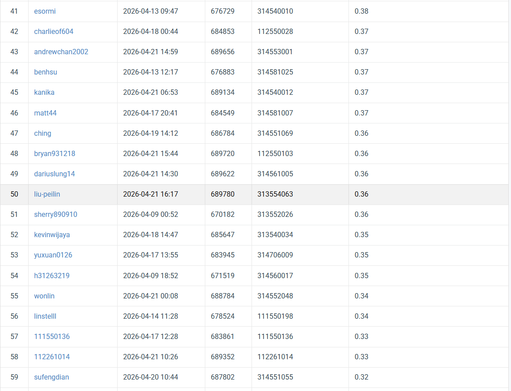

# HW2: Digit detection with improved DETR variants

## Introduction

This project studies house number digit detection in natural images. The main challenge is that the target digits are often small, blurred, and placed very close to each other. To address this problem, I started from a DETR-style detector and gradually improved the model with a Deformable-DETR-inspired design.

The final main direction is a **single-stage detector with 4-level multi-scale features and DAB-style 4D anchor references**. In addition to model-side improvements, I also tested inference-time strategies such as TTA, WBF, and NMS-based ensembling.

Main findings:

- 4-level features (`C2/C3/C4/C5`) improved small-digit detection.
- DAB-style 4D anchor references improved localization stability.
- Two-stage high-resolution fine-tuning did not outperform the best single-stage model.
- For inference, **NMS** performed better than **WBF** on this task.

---

## Environment Setup

### 1. Python environment

Recommended Python version:

```bash
python3 -m venv myenv
source myenv/bin/activate
```

### 2. Install dependencies

```bash
pip install torch torchvision torchaudio
pip install numpy scipy pillow tqdm matplotlib pycocotools
```

If needed, install Jupyter / notebook related packages separately.

### 3. Dataset structure

The code assumes the following directory structure:

```bash
NYCU_CV_HW2/
├── nycu-hw2-data/
│   ├── train/
│   ├── valid/
│   ├── test/
│   ├── train.json
│   └── valid.json
├── Deformable_Detr.py
├── generate_submission_ensemble.py
└── ...
```

Please adjust `PROJECT_ROOT` and `DATA_ROOT` in the code if your paths are different.

---

## Usage

### 1. Train the main model

The final cleaned training version is:

```bash
python Deformable_Detr.py
```

This script will:

- train the detector
- save checkpoints
- write `training_log.txt`
- evaluate validation mAP
- save debug prediction images
- generate prediction json files for submission

### 2. Generate submission files

Example scripts used during experiments include:

- `generate_submission_ensemble.py`

### 3. Main experimental settings

Final strong single-stage model:

- image size: `128 x 320`
- batch size: `8`
- backbone: `ResNet-50`
- feature levels: `C2/C3/C4/C5`
- hidden dimension: `256`
- queries: `100`
- encoder / decoder layers: `4 / 4`
- optimizer: `AdamW`
- backbone lr: `1e-5`
- other lr: `1e-4`
- weight decay: `1e-4`

---

## Performance Snapshot

### Validation

Best validation result of the strongest model:

- **Model:** v6 single-stage
- **Best epoch:** 5
- **mAP@0.5:0.95:** **0.4435**
- **mAP@0.5:** **0.8889**
- **mAP_small:** **0.4314**

### Public leaderboard

Best final leaderboard result:

- **Pipeline:** epoch 4 + 5 + 6 ensemble + TTA + NMS
- **Public score:** **0.36**

### Summary of major experiments

| Setting | Best valid mAP@0.5:0.95 | Public leaderboard |
|---|---:|---:|
| Deformable-DETR-inspired baseline | 0.4193 | about 0.32 |
| 4-level feature model | 0.4270 | about 0.35 |
| v6 single-stage | **0.4435** | **0.36** |

---

## Notes

- Only the **ResNet-50 backbone** uses pretrained weights.
- All transformer / detection components are trained from scratch.
- Heavy augmentation was not very effective for this task.
- NMS-based ensemble performed better than WBF in the final experiments.

